<p align="center">
  
</p>

<h1 align="center">mdview</h1>

<p align="center">
  <strong>The 1.9 MB Markdown app — double-click any .md file to read it like a webpage, press F2 to edit in place.</strong><br>
  Windows · macOS · Android &nbsp;|&nbsp; Built with Rust + WebView2, no Electron
</p>

<p align="center">
  <a href="https://www.mdview.top/">Website</a> ·
  <a href="https://github.com/mdview2026/mdview/releases/latest">Download</a> ·
  <a href="https://www.mdview.top/changelog.html">Changelog</a> ·
  <a href="https://www.mdview.top/blog/">Blog</a>
</p>

---

Most of the time you open a `.md` file, you just want to **read** it — a README, some notes, an AI-generated answer. Booting a full editor for that is overkill. mdview opens it instantly like a webpage, and when you do need to edit, `F2` gives you Obsidian-style WYSIWYG right inside the same window — no mode switch to another app.

- **1.9 MB installer**, opens in under a second, zero configuration
- **Read *and* edit** — clean full-page reading; `F2` WYSIWYG edit, `F3` dual-column with live preview
- **100% local** — no account, no ads, your files never leave your computer

<p align="center">
  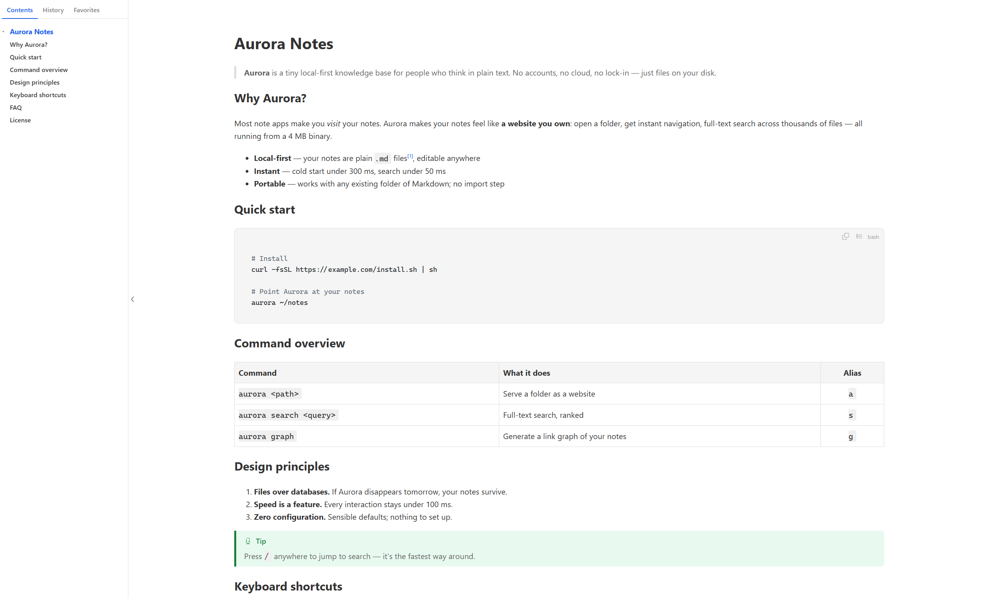
</p>

## Download

| Platform | Community (free forever) | Pro ($6.99 lifetime) |
|---|---|---|
| Windows 10/11 | [mdview-setup-latest.exe](https://github.com/mdview2026/mdview/releases/latest/download/mdview-setup-latest.exe) | [mdview-setup-pro-latest.exe](https://github.com/mdview2026/mdview/releases/latest/download/mdview-setup-pro-latest.exe) |
| macOS 11+ | [mdview-macos-latest.dmg](https://github.com/mdview2026/mdview/releases/latest/download/mdview-macos-latest.dmg) | [mdview-macos-pro-latest.dmg](https://github.com/mdview2026/mdview/releases/latest/download/mdview-macos-pro-latest.dmg) |
| Android 7.0+ | [mdview.apk](https://www.mdview.top/download/mdview.apk) | — |

Both editions are the same product and overwrite each other on install — switch anytime. Android is Community only.

> **SmartScreen warning?** Windows flags apps without an expensive code-signing certificate. Click **More info → Run anyway**. mdview runs entirely locally and uploads nothing.

## Features

### Preview

- **Double-click to open** — installer auto-associates `.md` files; also `Ctrl+O`, drag-and-drop, and Explorer context menu
- **Live refresh** — save in any editor and the page re-renders instantly (SSE push), keeping your scroll position
- **Outline panel** — floating TOC with click-to-jump and scroll sync, plus **History** (grouped by day) and **Favorites** tabs
- **Reading position memory** — reopens where you left off; single window per file
- **9 color themes + dark/light mode** — Glacier, Forest, Sunset, Typewriter… one right-click to switch
- **Type controls** — pick any installed font; `Ctrl+scroll` for font size, `Alt+scroll` for column width (real reflow, not bitmap zoom)
- **Full rendering** — tables with alignment, footnotes with back-links, local images, syntax-highlighted code blocks (copy / wrap / line numbers)
- **Export to PDF**, single-newline-as-break toggle, GBK/GB18030 encoding fallback, auto update checks

<table>
  <tr>
    <td>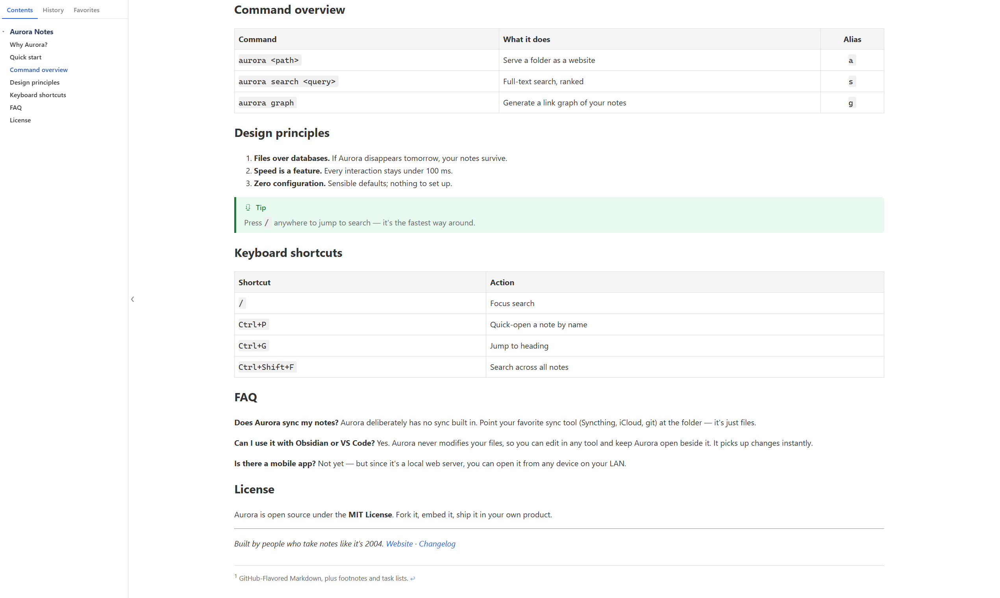</td>
    <td>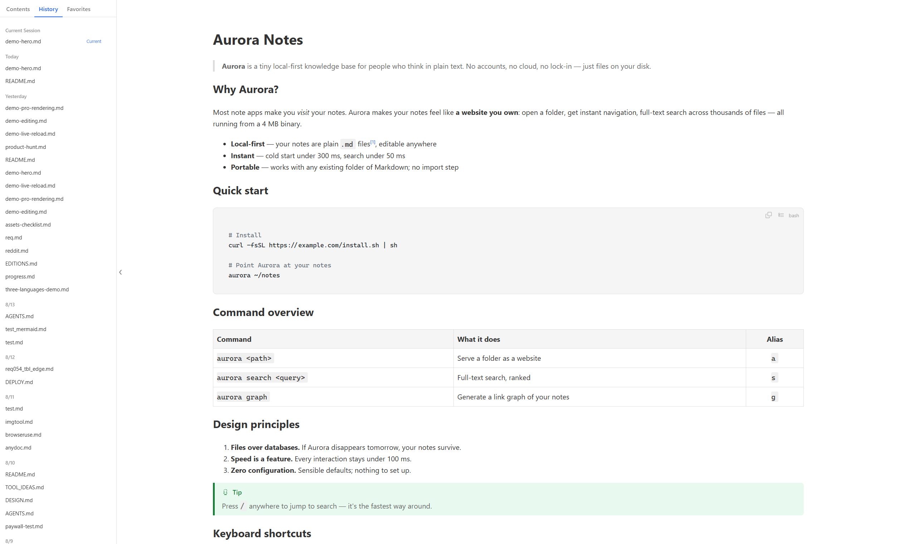</td>
  </tr>
  <tr>
    <td align="center"><sub>Outline tracks your scroll position</sub></td>
    <td align="center"><sub>History &amp; favorites, grouped by day</sub></td>
  </tr>
</table>

**9 color themes + dark mode**, one right-click to switch:

<table>
  <tr>
    <td>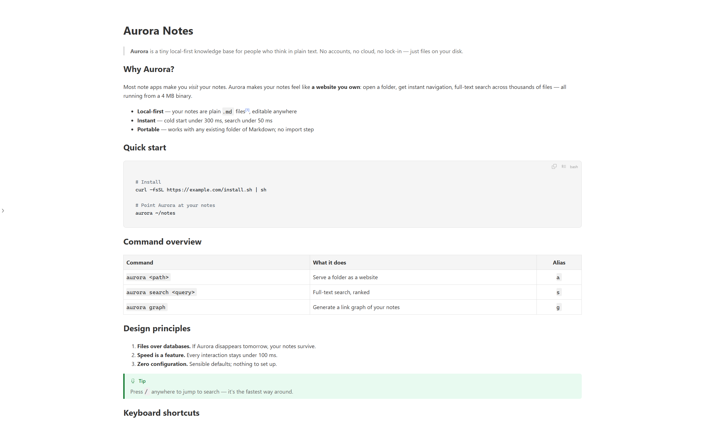</td>
    <td>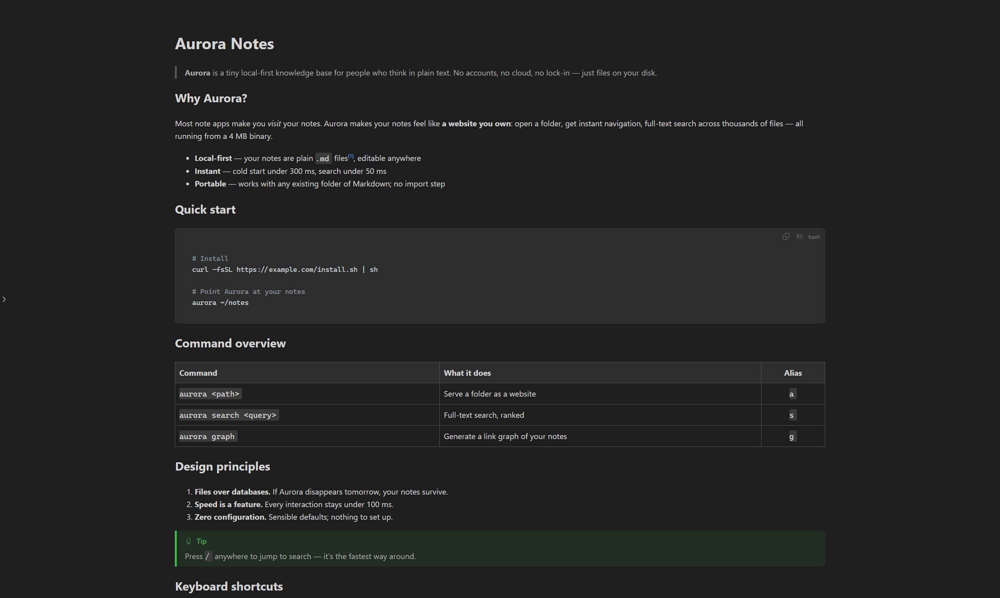</td>
    <td>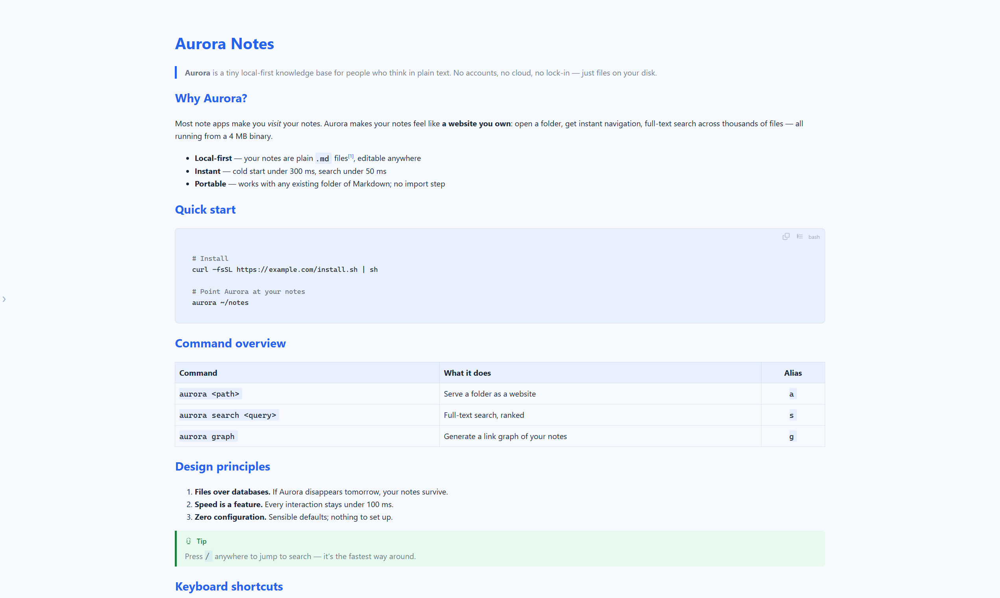</td>
    <td>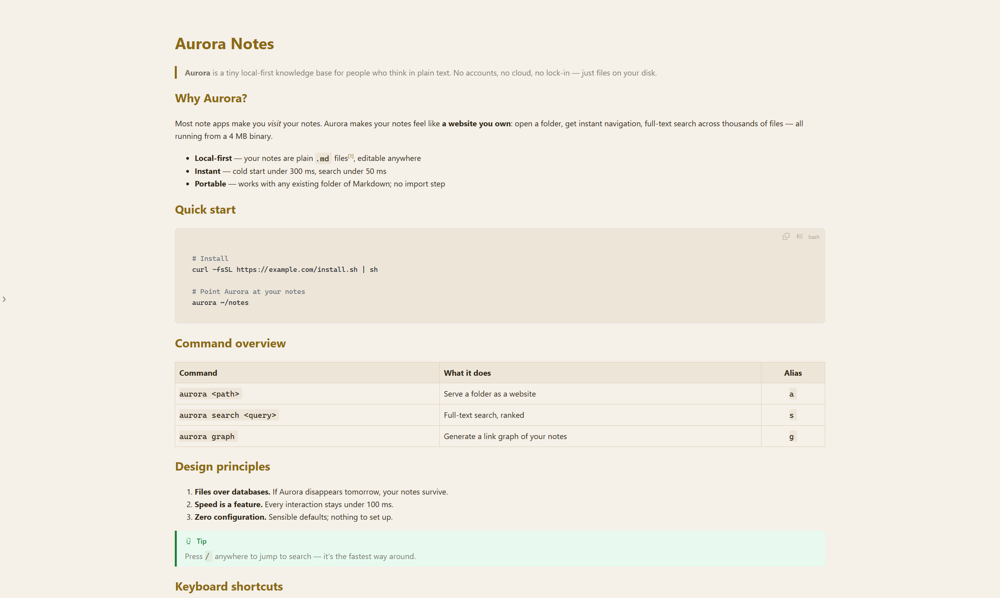</td>
  </tr>
  <tr>
    <td align="center"><sub>Default</sub></td>
    <td align="center"><sub>Dark</sub></td>
    <td align="center"><sub>Glacier</sub></td>
    <td align="center"><sub>Typewriter</sub></td>
  </tr>
  <tr>
    <td>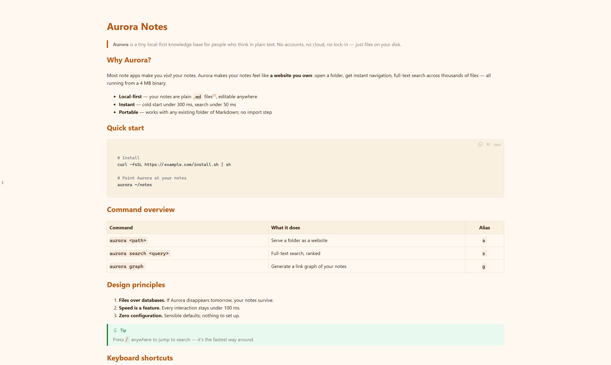</td>
    <td>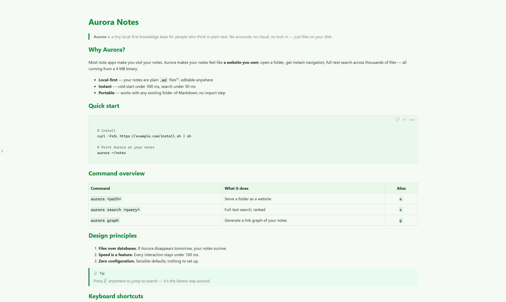</td>
    <td>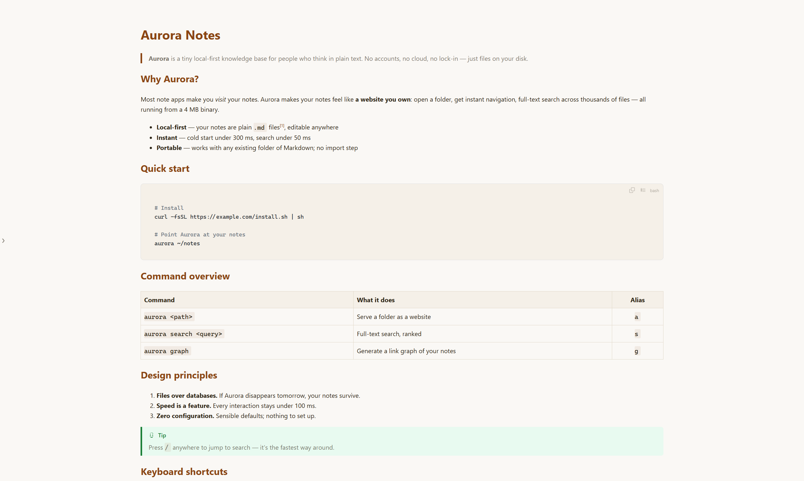</td>
    <td>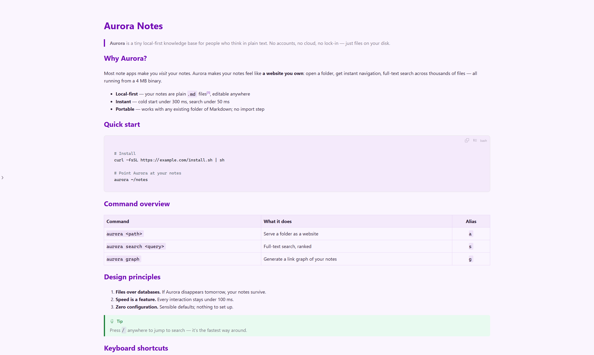</td>
  </tr>
  <tr>
    <td align="center"><sub>Sunset</sub></td>
    <td align="center"><sub>Forest</sub></td>
    <td align="center"><sub>Editorial</sub></td>
    <td align="center"><sub>Violet</sub></td>
  </tr>
  <tr>
    <td>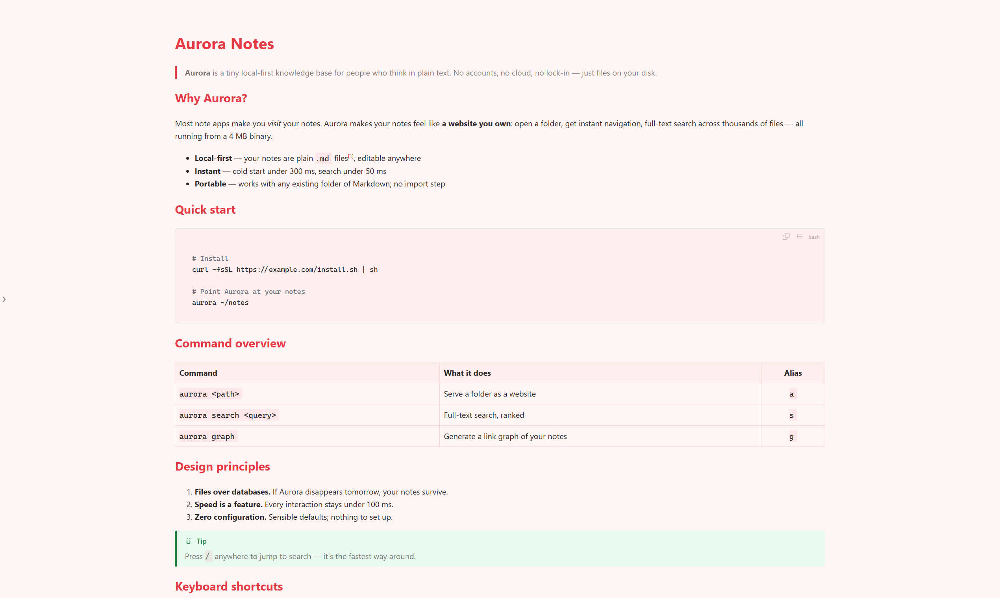</td>
    <td>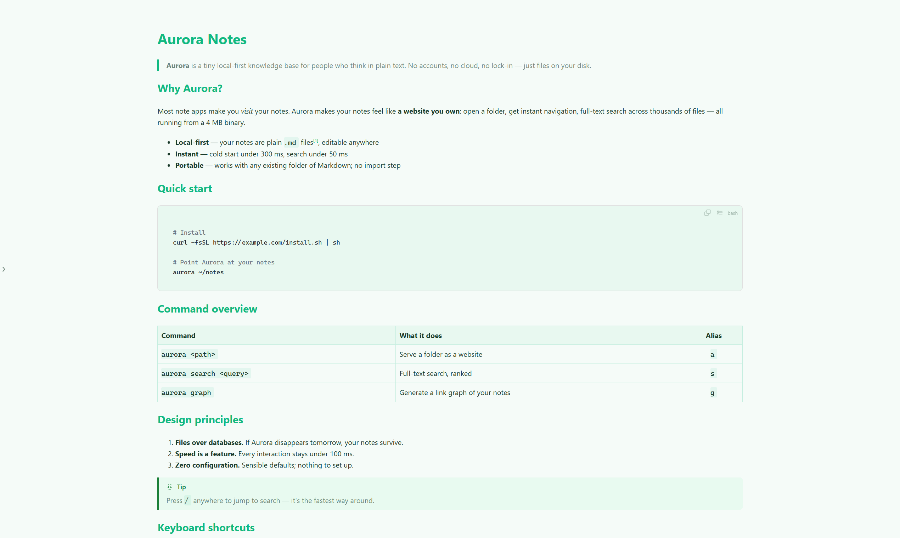</td>
    <td>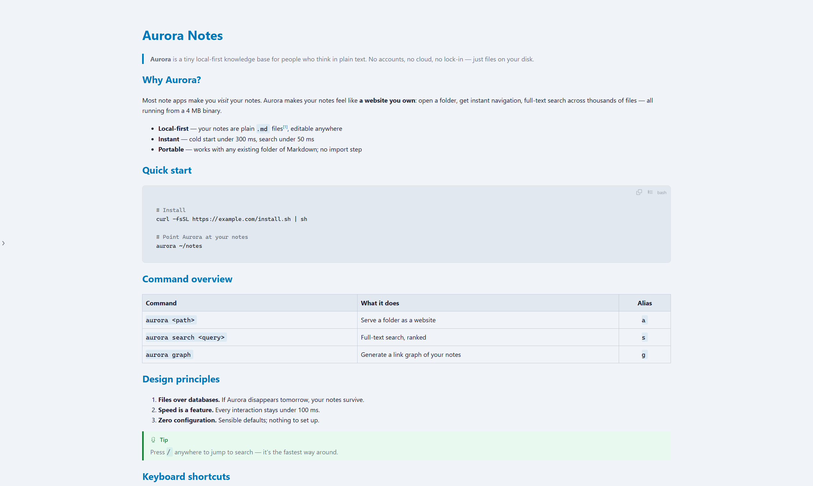</td>
    <td></td>
  </tr>
  <tr>
    <td align="center"><sub>Lychee</sub></td>
    <td align="center"><sub>Mint</sub></td>
    <td align="center"><sub>Neon</sub></td>
    <td></td>
  </tr>
</table>

### Editing

| Key | Mode | Edition |
|---|---|---|
| `F2` | **Live Edit** — Obsidian-style WYSIWYG inside the preview: formatting, links, tables (row/column ops), callouts | Pro |
| `F3` | **Dual-column edit** — source left, live preview right, scroll synced by section; `Tab` expands snippets; pasting an image/file auto-saves it to `.__assets/` and inserts the Markdown | Pro |
| `F4` / `Ctrl+E` | **External edit** — opens VS Code / Sublime / Notepad++ / Notepad (auto-detected) at the exact line of the selected text | Free |
| `Esc` / `Ctrl+W` | Close the window | Free |

<p align="center">
  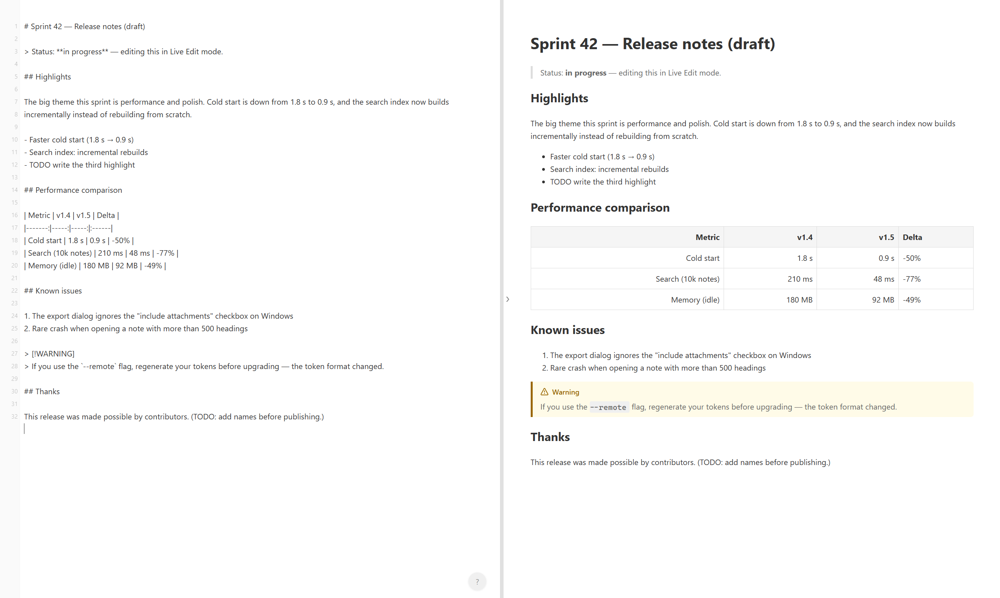
</p>

### Pro rendering

- **Mermaid diagrams** (flowcharts / sequence / Gantt) with a double-click fullscreen viewer — wheel zoom, drag pan
- **KaTeX math formulas** — inline `$...$` and block `$$...$$` LaTeX
- Rendering engines download once on first use, then work fully offline

<table>
  <tr>
    <td>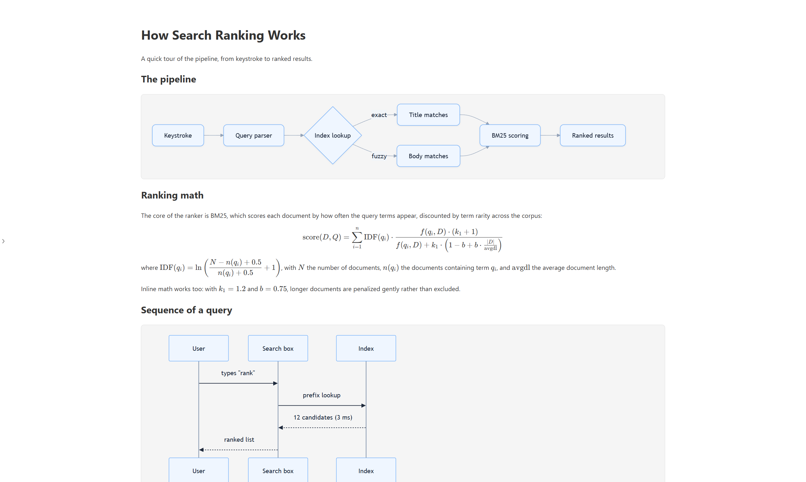</td>
    <td>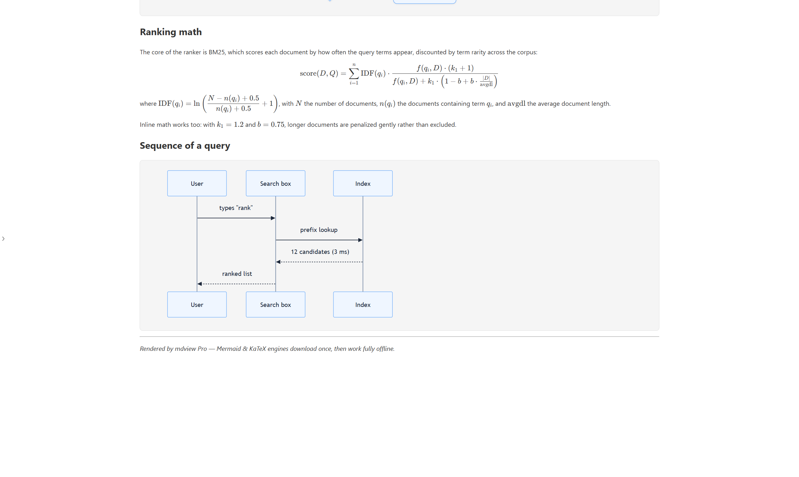</td>
  </tr>
  <tr>
    <td align="center"><sub>Mermaid diagrams</sub></td>
    <td align="center"><sub>KaTeX math</sub></td>
  </tr>
</table>

## Pricing

| | Community | Pro |
|---|---|---|
| Price | **Free forever** (optional sponsorship) | **$6.99** one-time lifetime unlock (Gumroad: card / PayPal) |
| Core reading features | ✅ everything | ✅ everything |
| Mermaid + KaTeX | — | ✅ |
| Live Edit (F2) + Dual-column edit (F3) | — | ✅ |
| Trial | — | 100 free opens, then a dismissible "Maybe Later" prompt — **never hard-locks** |

## Quick start

1. Download and run the installer (or the portable `mdview.exe`)
2. It automatically associates `.md` files (unbind anytime: right-click → Settings, or `mdview --unbind`)
3. Double-click any Markdown file and read

## Command line

```bash
mdview                     # run once: auto-associates .md files
mdview <file.md>           # preview a specific file
mdview --install           # add "Open with mdview" to the Explorer context menu
mdview --uninstall         # remove the context menu
mdview --settings          # settings window (association, recent files, editor)
mdview --unbind            # remove .md default association
mdview --help              # help
```

## Environment variables

| Variable | Description |
|---|---|
| `PORT` | HTTP server port (default: random free port, fallback 3456) |
| `MD_HTML=1` | Also output a rendered `.html` next to the `.md` file |
| `MD_HTML_OUTPUT=<path>` | Output the `.html` to a specific path |
| `MD_EDITOR` | Editor command for `F4` (e.g. `code --goto "{file}:{line}"`); auto-detected if unset |

## Tech stack

- **Language**: Rust (edition 2021)
- **GUI**: wry (WebView2) + tao
- **HTTP**: axum + tokio (localhost only)
- **Markdown**: embedded md4c
- **File watching**: notify + SSE live reload
- **Styling**: Tailwind CSS
